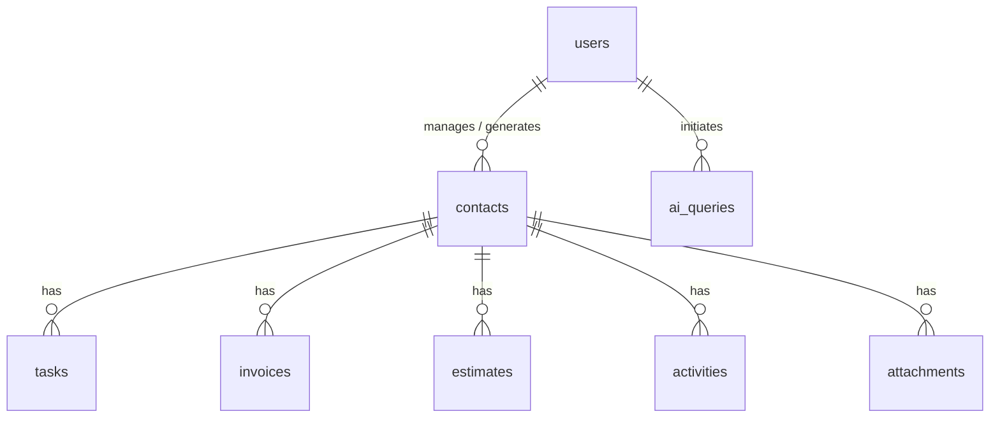

# Entity Relationship (ER) Diagram

```mermaid
erDiagram
    users ||--o{ contacts : "manages / generates"
    contacts ||--o{ tasks : "has"
    contacts ||--o{ invoices : "has"
    contacts ||--o{ estimates : "has"
    contacts ||--o{ activities : "has"
    contacts ||--o{ attachments : "has"
    users ||--o{ ai_queries : "initiates"
```
